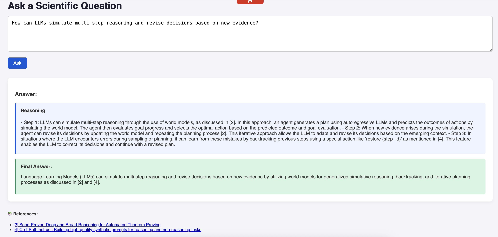

# 🤖 LLM-Based Scientific Q&A App with Inline Citations

A local web app that answers scientific questions using academic papers, providing step-by-step reasoning and inline citations like [1], [2].

---

## ✨ Key Features & Enhancements

- 🔍 **Semantic search** using SentenceTransformers (`all-MiniLM-L6-v2`)
- 📥 **arXiv paper fetching** (downloaded, parsed, chunked)
- 🧠 **Chunk vectorization** with FAISS for fast nearest neighbor retrieval
- 🪄 **LLM-driven summaries** of relevant papers using **Mistral via Ollama**
- 🧩 **Chain-of-Thought prompting** for step-by-step reasoning
- 🔗 **Inline citation markers** ([1], [2]) matched with clickable bibliography
- 📚 **Structured memory per paper** for fine-grained summarization
- 🌐 **Modern FastAPI web interface** with live query handling
- 🎨 **Clean UI** with readable outputs, consistent typography, and responsive design
- ⚡ Optimized prompt formatting and memory grouping to reduce LLM latency

---

## 📂 Project Structure

```
llm-scientific-qa/
├── data/
│   ├── raw/                         # Raw downloaded arXiv PDFs
│   ├── processed/chunks.jsonl       # Paper chunks (jsonl format)
│   └── vector/faiss.index           # FAISS vector index
│
├── src/
│   ├── fetch_arxiv.py              # Script to fetch and parse arXiv papers
│   ├── vector/
│   │   └── query_with_llm.py        # Full pipeline logic
│   └── web/
│       ├── main.py                  # FastAPI backend logic
│       └── templates/
│           └── index.html           # Frontend UI template (Jinja2)
│
├── assets/
│   └── screenshot.png               # Demo screenshot for README
│
├── requirements.txt
└── README.md
```

---

## ⚙️ Setup Instructions

### 1. Clone & Create Environment
```bash
git clone https://github.com/yourusername/llm-scientific-qa.git
cd llm-scientific-qa
python -m venv venv
source venv/bin/activate  # or venv\Scripts\activate on Windows
```

### 2. Install Dependencies
```bash
pip install -r requirements.txt
```

### 3. Run Ollama with Mistral
```bash
ollama serve
ollama pull mistral
```
> Ollama must remain running in the background.

---

## 🚀 Launch the Web App
```bash
uvicorn src.web.main:app --reload
```
Then visit: [http://127.0.0.1:8000](http://127.0.0.1:8000)

---

## 💡 How It Works (Technical Overview)

1. **arXiv papers** are downloaded, parsed, and split into semantically meaningful chunks.
2. **Chunk embeddings** are generated using SentenceTransformers.
3. **FAISS index** is built and queried to find the top-k most relevant chunks for a given question.
4. **Chunks grouped** by `paper_id` for per-paper summarization.
5. **Summarization**: Each group is summarized via Mistral LLM (via Ollama).
6. **Reasoning and citation generation** is done using Chain-of-Thought prompting.
7. **Final answer** is constructed with inline citations like [1], [2] and shown in the UI.

---

## 🖼️ Demo Screenshot



---

## 📤 Example Query

> **Question:** How do LLMs simulate multi-step reasoning and revise decisions?

**Answer Output:**
```
Reasoning:
- Step 1: ... [2]
- Step 2: ... [2]
- Step 3: ... [4]

Final Answer:
LLMs revise decisions and simulate multi-step reasoning via world models, iterative evaluation, and backtracking. [2][4]
```

**References:**
```
[1] Paper Title - https://arxiv.org/abs/xxx
[2] Paper Title - https://arxiv.org/abs/yyy
...
```

---

## 🛠️ Requirements

```txt
fastapi
uvicorn
faiss-cpu
sentence-transformers
numpy
jinja2
ollama
```

---

## 📦 Technologies Used

- 🧠 SentenceTransformers (SBERT)
- 🔍 FAISS similarity search
- 📥 arXiv PDF parsing and chunking
- 🧩 Ollama (Mistral LLM backend)
- ⚡ FastAPI for backend routing
- 🌐 Jinja2 + HTML + CSS for frontend
- 🧱 Chain-of-Thought Prompt Engineering

---

## 👤 Author
Built by [Iremsu Savas] – ML Engineer with deep interest in applied AI, scientific reasoning, and LLM-powered tools.

Feel free to ⭐️ the repo and reach out if you'd like to collaborate!

